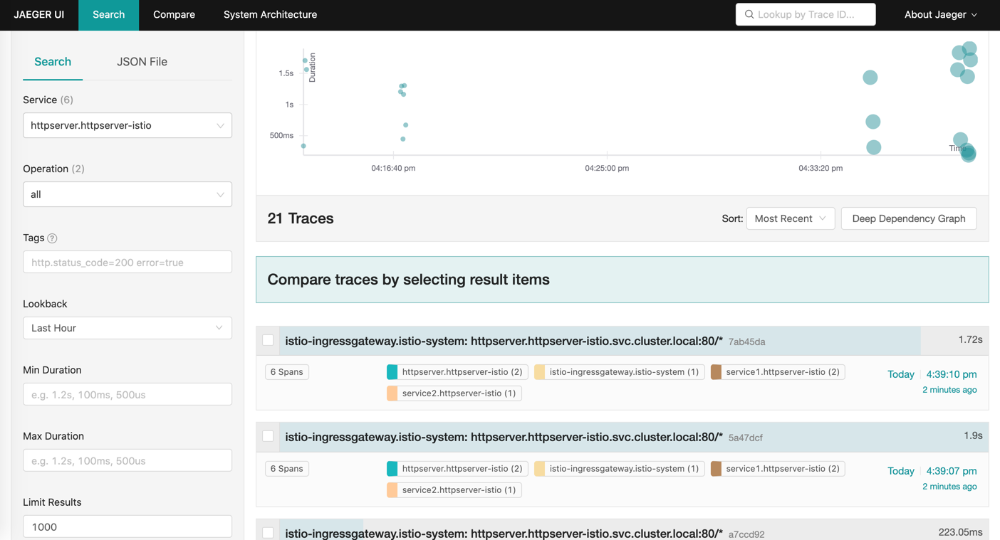
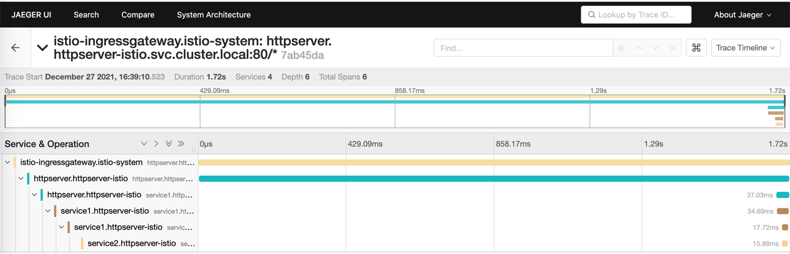
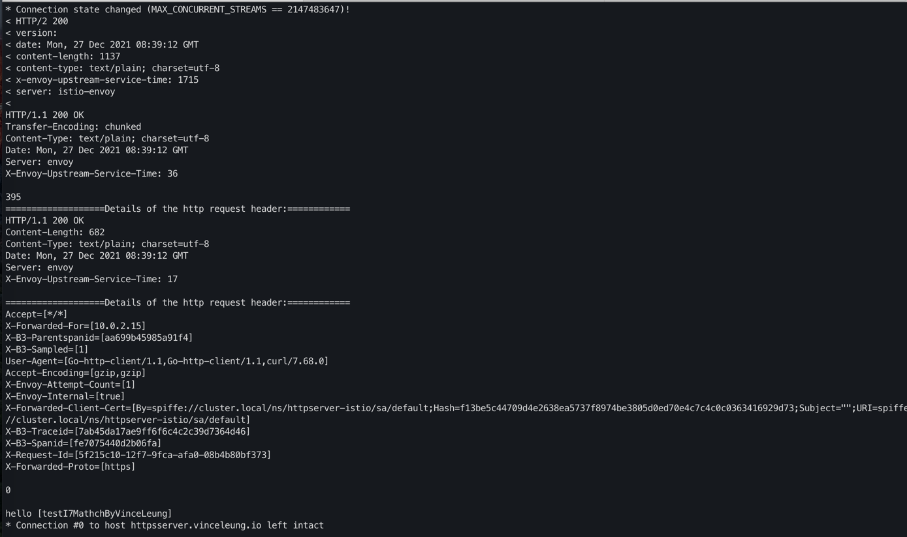
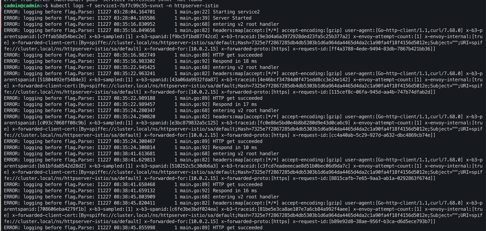
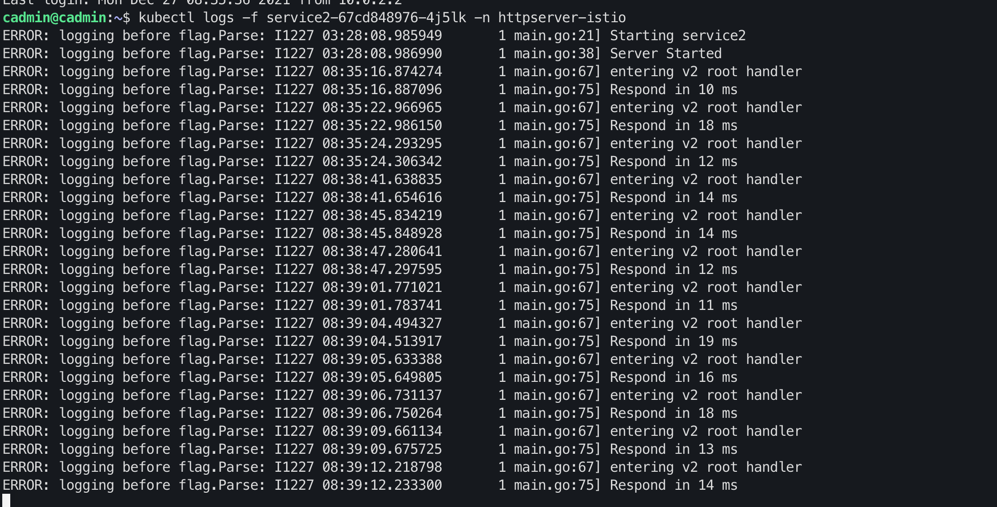

# 模块十二
## 把httpserver服务以 Istio Ingress Gateway 的形式发布

### 1、实现安全保证

#### deploy httpserver

```
cd httpserver/specs/istio
kubectl create ns httpserver-istio
kubectl label ns httpserver-istio istio-injection=enabled
kubectl create -f httpserver.yaml -n httpserver-istio
```
```
openssl req -x509 -sha256 -nodes -days 365 -newkey rsa:2048 -subj '/O=vinceleung Inc./CN=*.vinceleung.io' -keyout vinceleung.io.key -out vinceleung.io.crt
kubectl create -n istio-system secret tls vinceleung-credential --key=vinceleung.io.key --cert=vinceleung.io.crt
kubectl apply -f istio-specs.yaml -n httpserver-istio
```

### check ingress ip
```
k get svc -nistio-system
istio-ingressgateway   LoadBalancer   $INGRESS_IP
```
### access the httpserver via ingress
```
curl --resolve httpsserver.vinceleung.io:443:$INGRESS_IP https://httpsserver.vinceleung.io/healthz -v -k
```


### 2、七层路由规则
httpserver/specs/istio/istio-specs.yaml 文件增加url匹配规则
```
- match:
  - uri:
  exact: "/vinceleung/"
  rewrite:
  uri: "/"
  route:
  - destination:
  host: httpserver.httpserver-istio.svc.cluster.local
  port:
  number: 80
  - 
```
```
kubectl apply -f istio-specs.yaml -n httpserver-istio
```
```
curl --resolve httpsserver.vinceleung.io:443:10.99.239.22 https://httpsserver.vinceleung.io/vinceleng?user=testI7MathchByVinceLeung -v -k
```

### 3、open tracing 的接入

#### main.go deal with header

```
req, err := http.NewRequest("GET", "http://service1", nil)
if err != nil {
    fmt.Printf("%s", err)
}
lowerCaseHeader := make(http.Header)
for key, value := range r.Header {
    lowerCaseHeader[strings.ToLower(key)] = value
}
glog.Info("headers:", lowerCaseHeader)
req.Header = lowerCaseHeader
```

```
kubectl apply -f jaeger.yaml
```
update sampling rate is 100%
```
kubectl edit configmap istio -n istio-system
set tracing.sampling=100
```


#### deploy tracing
```
kubectl apply ns httpserver-istio
kubectl label ns httpserver-istio istio-injection=enabled
kubectl -n httpserver-istio apply -f httpserver.yaml
kubectl -n httpserver-istio apply -f service1.yaml
kubectl -n httpserver-istio apply -f service2.yaml
kubectl apply -f istio-specs.yaml -n httpserver-istio
```
#### check ingress ip
```
k get svc -nistio-system
istio-ingressgateway   LoadBalancer   $INGRESS_IP
```
#### access the tracing via ingress for 100 times(sampling rate is 100%)
```

 for i in `seq 1 100`; do curl -s -o /dev/null --resolve httpsserver.vinceleung.io:443:10.99.239.22 https://httpsserver.vinceleung.io/vinceleng?user=testI7MathchByVinceLeung -v -k
; done

curl --resolve httpsserver.vinceleung.io:443:10.99.239.22 https://httpsserver.vinceleung.io/vinceleng?user=testI7MathchByVinceLeung -v -k

```
#### check tracing dashboard

```
istioctl dashboard jaeger
```

update tracing svc type:NodePort
```
k get svc -n istio-system
k edit svc tracing -n istio-system
k get svc -n httpserver-istio
```
```
k get svc -n httpserver-istio
```
```
NAME                   TYPE           CLUSTER-IP       EXTERNAL-IP   PORT(S)                                                                      AGE
istio-egressgateway    ClusterIP      10.96.133.190    <none>        80/TCP,443/TCP                                                               5d23h
istio-ingressgateway   LoadBalancer   10.99.239.22     <pending>     15021:31527/TCP,80:30214/TCP,443:32739/TCP,31400:32333/TCP,15443:30035/TCP   5d23h
istiod                 ClusterIP      10.100.95.126    <none>        15010/TCP,15012/TCP,443/TCP,15014/TCP                                        5d23h
jaeger-collector       ClusterIP      10.102.235.222   <none>        14268/TCP,14250/TCP,9411/TCP                                                 3d6h
tracing                NodePort       10.101.15.51     <none>        80:31001/TCP,16685:32201/TCP                                                 3d6h
zipkin                 ClusterIP      10.104.33.154    <none>        9411/TCP
```
access tracing dashboard
```
http://192.168.34.2:tracingNodePort/

http://192.168.34.2:31001/
```
search



trace


httpserver response


service1 log


service2 log
